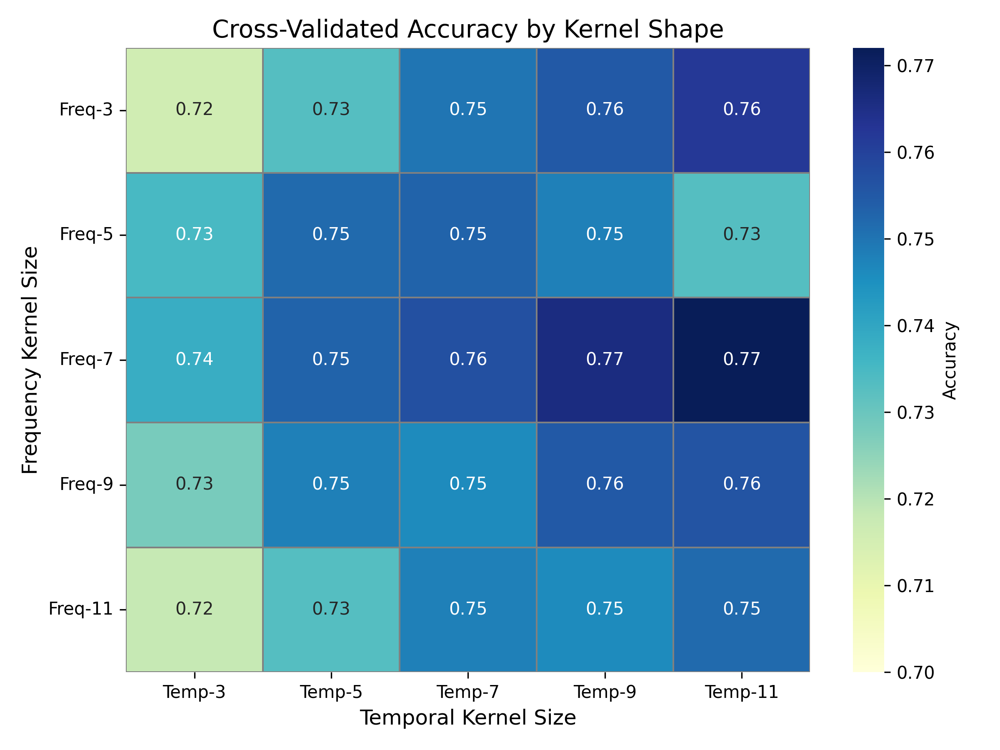

### Setup

## Get ESC-50 Dataset

```
wget https://github.com/karolpiczak/ESC-50/archive/master.zip
unzip master.zip
```

## Install Dependencies and Run
(with uv)

If you don't want to use wandb:

* Remove `wandb` from `pyproject.toml`
* Remove `import wandb` from `kernel_shapes/train.py`
* Set `use_wandb` to `False` in the `if __name__ == "__main__":` block

```
uv pip install .[dev]
uv run python -m kernel_shapes.create_specs
uv run python -m kernel_shapes.train
```

## Description
from (https://stuff.danavery.com/posts/2025-05-15-kernel-shape/)

Audio has a strong temporal component. Unlike an image, audio is a thing that happens in time, not an arrangement of items in a space. And yet many audio classification models treat spectrograms as if they were still images and not events, an artifact of early successes applying visual models to audio datasets.

I took the ESC-50 dataset, created a simple five-layer CNN model, and trained it with various kernel shapes and sizes. My hypothesis: **kernels that extend more in the temporal dimension will have better performance.**

Model setup:

Each run trained a 5-layer CNN (no augmentation, fixed architecture) on ESC-50 with varying kernel sizes. All layers used the same square/rectangular kernel shapes, from 3×3 up to 11×11. Padding preserved input shape. Cross-validation: 5 folds. Average of three separate runs with different random seeds.

Here are the validation accuracies for each kernel shape:



This shows an expected trend in accuracy as the kernel size increases in the temporal dimension. The highest accuracy was found at a kernel size of 7(frequency)x 11(temporal), with accuracies at all kernel shapes mostly increasing as the kernel temporal dimension increases. Accuracies did not increase proportionally with the frequency dimension, instead peaking at 7 and falling off at higher and lower sizes.

This looks like reasonable evidence that kernels extending in the temporal dimension perform better on audio classification tasks, providing some signal that audio should be treated more as a temporal sequence than a spatial map.

It might be worth investigating if the accuracies differ significantly between short, punctuated sounds like dog barks or gun shots and longer sounds like sirens or helicopters, all of which are ESC-50 classes.
